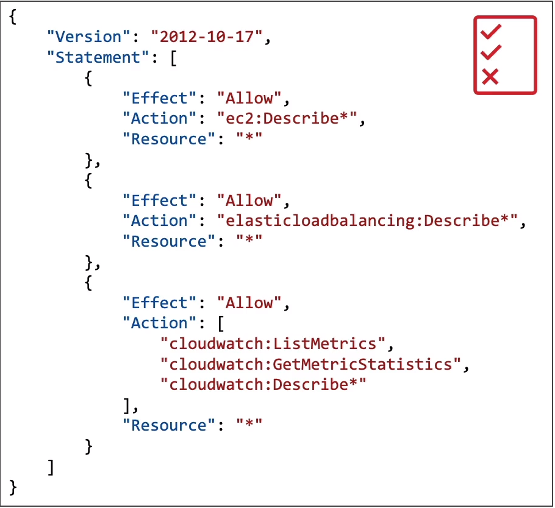

# IAM: Users and Groups
- **IAM = Identity and Access Management, Global Service**
- **Root Account is created by default, shouldn't be used or shared**
- **Users are people within your organization, and can be grouped**
- **Groups: Only contain users, not other groups**
- **Users don't have to belong to a group, and user can belong to multiple groups**

## IAM: Permissions
- Users or Groups can be assigned JSON documents called policies
- These policies define the permissions of the users
- In AWS you apply the least privilege principle: don't give more permissions than a user needs

## IAM Policies Structure:
- Consist of
  - Version: policy language version, always include "2012-10-17"
  - Id: an identifier for the policy (optional)
  - Statement: one or more individual statements (required)

- Statements consists of
  - Sid: an identifier for the statement (optional)
  - Effect: wheter the statement allows or denies access (Allow, Deny)
  - Principal: account/user/role to which this policy applied to
  - Condition: conditions for when this policy is in effect (optional)

## IAM Roles for Services
- Some AWS service will need to perform actions on your behalf
- To do so, we will assign permissions to AWS services with IAM Roles
#### Common roles:
- EC2 Instance Roles
- Lambda Funcion Roles
- Roles for CloudFormation

## IAM Security Tools
#### IAM Credentials Report (account level)
- A report that list all your account's users and the status of their various credentials

#### IAM Access Advisor (user-level)
- Access advisor shows the service permissions granted to a user and when tose services were last accessed
- You can use this information to revise your policies

#### IAM Guidelines and Best Practices
- Don't use the root account, except for AWS account setup
- Pne physical user = One AWS user
- Assign users to groups and assign permissions to groups
- Create a strong password policy
- Use and enforce the use of Multi Factor Authentication (MFA)
- Create and use Roles for giving permissions to AWS services
- Use Access Keys for programmatic Access (CLI, SDK)
- Adit permissions of your account using IAM Credentials Report and IAM Access Advisor
- Never share IAM users and Access Keys
