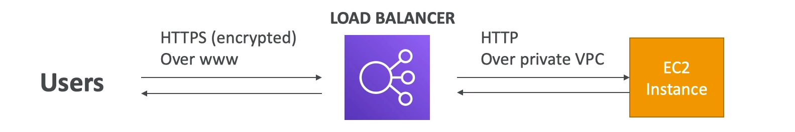

# What is SSL?

Secure Sockets Layer is a security protocol that provides privacy, authenctication, and integrity to Internet communications. SSL eventually evolved into Transport Layer Security (TLS).

SSL or Secure Sockets Layer encrypts data so that it can securely move from your customer to your webserver. It's used to protect confidential data, such as personal details or credit card information.

## How does SSL/TLS works?
- In order to provide a high degree of privacy, SSL encrypts data that is transmitted across the web. This means that anyone who tries to intercept this data will only see a garbled mix of characteres that is nearly impossible to decrypt.
- SSL initiates an authentication process called a handshake between two communicating devices to ensure that both devices are really who they claim to be.
- SSL also digitally signs data in order to provide data integrity, verifying that the data is not tampered with before reaching its intended recipient.

Originally, data on the Web was transmitted in plaintext that anyone could read if they intercepted the message. For example, if a consumer visited a shopping website, placed an order, and entered their credit card number on the website, that credit card number would travel across the Internet unconcealed.

SSL was created to correct this problem and protect user privacy. By encrypting any data that goes between a user and a web server, SSL ensures that anyone who intercepts the data can only see a scrambled mess of characters. The consumer's credit card number is now safe, only visible to the shopping website where they entered it.

SSL also stops certain kinds of cyber attacks: It authenticates web servers, which is important because attackers will often try to set up fake websites to trick users and steal data. It also prevents attackers from tampering with data in transit, like a tamper-proof seal on a medicine container.

## Load Balancer - SSL Certificates

- The load balancer uses an X.509 certificate (SSL/TLS server certificate)
- You can manage certificates using ACM (AWS Certificate Manager)
- You can create upload your own certificates alternatively
- HTTPS listener:
    - You must specify a default certificate
    - You can add an optional list of certs to support multiple domains
    - Clients can use SNI (Server Name Indication) to specify the hostname they reach

## Server Name Indication
- SNI solves the problem of loading **multiple SSL certificates onto one web server** (to serve multiple websites)
- It's a "newer" protocol, and requires the client to indicate the hostname of the target server in the initial SSL handshake
- The server will then find the correct certificate, or return the default one.

#### It only works for ALB and NLB (newer generation), CloudFront
#### Does not work for CLB (older gen)

