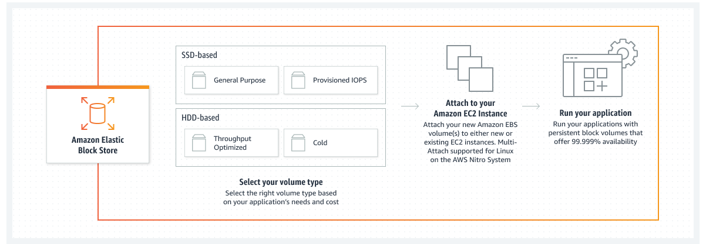

# AWS EBS (Elastic Block Store)
- Amazon EBS is an easy-to-use, scalable, high performance block-storage service designed for Amazon Elastic Compute Cloud (EC2).

- An EBS Volume is a network drive you can attach to your instance while they run.
- It allows your instances to persist data, even after their termination.
- They can only be mounted to one instance at a time.
- They are bound to a specific availability zone

* It's a network drive:
    - It uses the network to communicate the instance, which means there might be a bit of latency
    - It can be dettached from an EC2 instances and attached to another one quickly

* It's locked to an Availability Zone (AZ)
    - An EBS Volume in us-east-1a cannot be attached to us-east-b
    - To move a volume accross, you first need to snapshot it

* Have a provisioned capacity (size in GBs, and IOPS)
* You can increase the capacity of the driver over time

